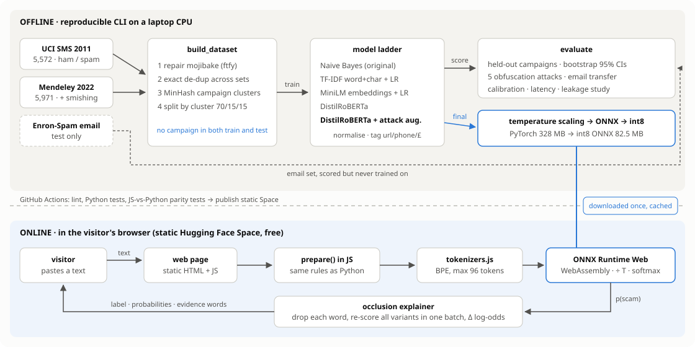

# SMS Scam Detector

[](https://github.com/hamad470/spam-detector/actions/workflows/ci.yml)
[](https://huggingface.co/spaces/hamadurrehman62/spam-detector)
[](https://huggingface.co/hamadurrehman62/sms-scam-distilroberta)


A classifier that tells normal texts, marketing spam and **smishing** (SMS phishing) apart, explains which
words drove each decision, and holds up when scammers disguise their wording. It's a fine-tuned DistilRoBERTa,
quantised to int8 ONNX, served by FastAPI on Hugging Face Spaces.

**Live demo:** https://huggingface.co/spaces/hamadurrehman62/spam-detector
**Full write-up:** [reports/REPORT.md](reports/REPORT.md)


## Results

Scored on 851 messages from spam **campaigns the model never saw in training** (see why below).

| Model | Macro-F1 (3 classes) | Scam vs ham F1 | Real texts flagged | Smishing recall | Size | Latency |
|---|---:|---:|---:|---:|---:|---:|
| **DistilRoBERTa + attack augmentation, int8 ONNX** (deployed) | **0.920** | **0.979** | 0.42% | **93.8%** | 82.5 MB | 10 ms |
| Naive Bayes (my original 2024 notebook) | 0.908 | 0.941 | **0.14%** | 86.3% | 0.1 MB | 2 ms |
| TF-IDF word + char n-grams, logistic regression | 0.896 | 0.972 | 0.56% | 88.7% | 1.2 MB | 2 ms |
| DistilRoBERTa, no augmentation | 0.870 | 0.955 | 1.41% | 80.0% | 328 MB | 47 ms |
| MiniLM sentence embeddings + logistic regression | 0.817 | 0.876 | 4.94% | 82.5% | 91 MB | 13 ms |


The deployed transformer has the best macro-F1, scam F1 and smishing recall. My original Naive Bayes raises
fewer false alarms. Naive Bayes stays within the confidence interval on macro-F1 but catches noticeably less smishing,
and it falls apart once messages are obfuscated (below).

## What I found along the way

This started as a rebuild of a 2024 Naive Bayes notebook that reported 98% accuracy. Adding a second dataset
turned it into a lesson in how easily SMS spam results get inflated.

**1. Most of the "new" 2022 data is the 2011 data.** 85% of the Mendeley smishing dataset is copied from the UCI
collection, often with broken encoding that hides the match. Only 881 messages are genuinely new.

**2. Spam is templated, so random splits leak.** Half of all spam messages belong to a near-duplicate campaign
(same text, different number or prize), against 7% of ham. A naive merge with a random split puts an exact copy
of 78% of test messages into training and reports F1 0.993. The same model scores 0.972 when whole campaigns are
held out.


**3. Disguised text breaks bag-of-words models.** Scammers write `fr33 pr1ze`, `c.l.a.i.m` or swap in Cyrillic
look-alike letters. My original Naive Bayes drops from 89% to 54% of scams caught when 70% of words are
disguised. A text normaliser plus a transformer fine-tuned on disguised copies stays above 95%.


More detail on every step, including the error analysis, calibration and an out-of-domain email test, is in
[the report](reports/REPORT.md). The data audit is in [data/README.md](data/README.md).

## How it works



- **Data:** UCI 2011 + Mendeley 2022, encoding repaired with `ftfy`, exact and near-duplicates (MinHash LSH)
  grouped, then split by campaign with `StratifiedGroupKFold`.
- **Text normalisation:** undoes leetspeak, look-alike Unicode, spaced-out letters and zero-width characters,
  then tags links, phone numbers and money amounts so the model generalises past specific numbers.
- **Model:** `distilroberta-base` fine-tuned for 4 epochs (early stopping on validation macro-F1), with an
  obfuscated copy of every scam message and 20% of ham added to training. Temperature scaling on the
  validation set calibrates the probabilities (ECE 0.008).
- **Decision:** scam vs not-scam is decided first (P(spam) + P(smishing) ≥ 0.5), then which kind. Plain
  argmax can label a message "ham" while most of its probability says scam.
- **Serving:** exported to ONNX and dynamically quantised to int8: 4× smaller and 5× faster, agreeing with the
  PyTorch model on 99.5% of test messages. The service needs only `onnxruntime` and `tokenizers`, no PyTorch.
- **Explanations:** occlusion. Each word is removed in turn, all variants are scored in one batch, and the
  change in scam log-odds is reported. This works for any model and is cheap at SMS length.

## API

```bash
curl -X POST https://hamadurrehman62-spam-detector.hf.space/api/classify \
  -H "Content-Type: application/json" \
  -d '{"text": "Y0ur acc0unt has been l0cked. Ver1fy y0ur det4ils at secure-l0gin.net"}'
```

```json
{
  "label": "smishing",
  "probabilities": {"ham": 0.0527, "spam": 0.022, "smishing": 0.9253},
  "scam_probability": 0.9473,
  "evidence": [
    {"word": "secure-l0gin.net", "start": 53, "end": 69, "impact": 5.525},
    {"word": "l0cked.", "start": 22, "end": 29, "impact": -0.774}
  ]
}
```

`impact` is the drop in scam log-odds when that word is removed: the fake domain alone carries the decision.

| Endpoint | Purpose |
|---|---|
| `POST /api/classify` | One message (up to 1,000 characters), with word-level evidence |
| `POST /api/classify/batch` | Up to 64 messages, no explanations |
| `GET /api/model` | Model card: test metrics for every model compared |
| `GET /docs` | Swagger UI |

## Reproduce it

```bash
git clone https://github.com/hamad470/spam-detector.git && cd spam-detector
python -m venv .venv && source .venv/bin/activate      # Windows: .venv\Scripts\activate
pip install -r requirements-train.txt && pip install --no-deps -e .

python -m spam_detector.datasets                       # download the three datasets
python -m spam_detector.build_dataset                  # audit, de-duplicate, grouped split
python -m spam_detector.models.transformer --augment   # ~1 hour on a laptop CPU
python -m spam_detector.models.transformer             # the no-augmentation comparison
python -m spam_detector.evaluate                       # trains the baselines, runs every experiment
python -m spam_detector.export                         # int8 ONNX + model card
python -m spam_detector.figures
pytest
```

To run only the web app, `pip install -r requirements.txt` and start
`uvicorn app.main:app --port 7860`. It downloads the published model from the Hugging Face Hub on first start.

## Project structure

```
spam-detector/
├── app/                     FastAPI service and web UI (static HTML/CSS/JS)
├── src/spam_detector/
│   ├── datasets.py          download and load UCI, Mendeley, Enron
│   ├── text.py              encoding repair, de-obfuscation, entity tags
│   ├── dedup.py             MinHash near-duplicate campaign clusters
│   ├── build_dataset.py     merge, audit, grouped train/val/test split
│   ├── attacks.py           leetspeak, homoglyph, spacing, typo attacks
│   ├── models/              Naive Bayes, TF-IDF LR, MiniLM LR, DistilRoBERTa
│   ├── decision.py          scam-first decision rule
│   ├── evaluate.py          all experiments -> reports/results.json
│   ├── export.py            ONNX export, int8 quantisation, model card
│   ├── inference.py         ONNX Runtime classifier + occlusion explanations
│   ├── figures.py           every chart in this README and the report
│   └── publish.py           upload model and card to the Hugging Face Hub
├── reports/                 REPORT.md, results.json, data_audit.json, figures/
├── notebooks/               the original 2024 exploratory notebook
├── data/README.md           data card and audit findings
├── tests/                   unit tests and API tests
├── Dockerfile               Hugging Face Spaces image
└── .github/workflows/ci.yml lint, test, deploy to Spaces
```

## Limitations

- **Scams with no link, prize or number get through.** I tried a handful of current UK scams by hand. Parcel
  fees, HMRC refunds and crypto "withdrawals" are caught at over 95%, and genuine one-time codes, Uber and
  appointment texts pass. But "Hi mum, I've dropped my phone, this is my new number, can you send £200" scores
  1.5%, and a fake Netflix billing alert sits just under the line at 48%. Pure social engineering barely exists in
  the 2003-2022 training data, so the model has never seen it.
- **Spam vs smishing is a soft boundary.** 23 campaigns are labelled both ways in the source data, and most of the
  remaining errors are between those two classes. Ham vs not-ham is the reliable decision.
- **It doesn't transfer to email.** On Enron-Spam every model sits between 0.55 and 0.61 ROC-AUC, close to
  chance.
- **Single training run per configuration.** The augmented model's lead over the plain one is larger than the
  bootstrap intervals, but I haven't averaged over seeds.

## Data and credits

- [UCI SMS Spam Collection](https://archive.ics.uci.edu/dataset/228/sms+spam+collection), Almeida and
  Gómez Hidalgo (2011), CC BY 4.0
- [SMS Phishing Dataset](https://data.mendeley.com/datasets/f45bkkt8pr/1), Mishra and Soni (2022),
  DOI 10.17632/f45bkkt8pr.1, CC BY 4.0
- [Enron-Spam](https://huggingface.co/datasets/SetFit/enron_spam), Metsis et al. (2006), used only as an
  out-of-domain test
- Base model: [distilroberta-base](https://huggingface.co/distilroberta-base)

## Author

**Hamad Ur Rehman**, MSc Data Science. [GitHub](https://github.com/hamad470) ·
[Hugging Face](https://huggingface.co/hamadurrehman62)
