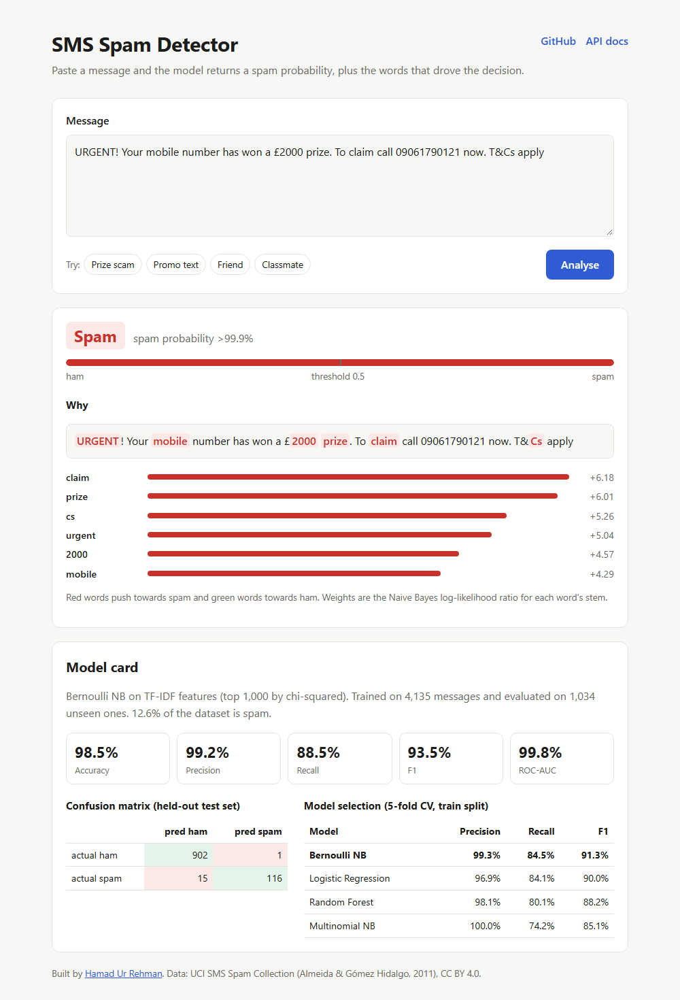
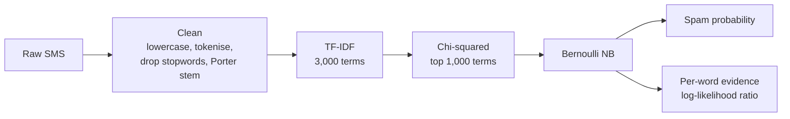

# SMS Spam Detector

[](https://github.com/hamad470/spam-detector/actions/workflows/ci.yml)
[](https://huggingface.co/spaces/hamad470/spam-detector)


An explainable SMS spam classifier. You give it a message and it returns a spam probability **and the words that drove the decision**. It's served as a FastAPI service with a small web UI, and deployed as a Docker container on Hugging Face Spaces.

**Live demo:** https://huggingface.co/spaces/hamad470/spam-detector
**API docs (Swagger):** https://hamad470-spam-detector.hf.space/docs



## Results

Evaluated once on a stratified held-out test set of 1,034 messages that were never used for training or model selection:

| Accuracy | Precision | Recall | F1 | ROC-AUC |
|---:|---:|---:|---:|---:|
| 98.5% | 99.2% | 88.5% | 93.5% | 99.8% |

|  | predicted ham | predicted spam |
|---|---:|---:|
| **actual ham** | 902 | 1 |
| **actual spam** | 15 | 116 |

I tuned for **precision**: the costly mistake for a spam filter is hiding a real message, and that happened once in 903 legitimate texts. The trade-off is that about 1 in 9 spam messages gets through (recall 88.5%).

### Model selection

Four classifiers share the same preprocessing and features and were compared with stratified 5-fold cross-validation on the training split only:

| Model | Precision | Recall | F1 |
|---|---:|---:|---:|
| **Bernoulli Naive Bayes** (selected) | 99.3% | 84.5% | **91.3%** |
| Logistic Regression | 96.9% | 84.1% | 90.0% |
| Random Forest | 98.1% | 80.1% | 88.2% |
| Multinomial Naive Bayes | 100.0% | 74.2% | 85.1% |

Bernoulli NB won on F1 while staying near-perfect on precision. It's also an 80 KB model that predicts in under a millisecond, which suits a free CPU host. The full exploratory analysis (message length distributions, word clouds, the original model comparison) is in [`notebooks/01_eda_and_model_comparison.ipynb`](notebooks/01_eda_and_model_comparison.ipynb).

## How it works



All four steps are one scikit-learn `Pipeline`, saved as a single artefact. Training and serving share the same preprocessing code, which rules out train/serve skew.

**Explanations:** for each word in the message that is in the model's vocabulary, the API reports the Naive Bayes log-likelihood ratio `log P(word | spam) - log P(word | ham)`. Positive means the word is more typical of spam. The UI uses this to highlight the message.

## API

```bash
curl -X POST https://hamad470-spam-detector.hf.space/api/predict \
  -H "Content-Type: application/json" \
  -d '{"text": "WINNER! Claim your free prize now, text WIN to 80086"}'
```

```json
{
  "label": "spam",
  "spam_probability": 1.0,
  "evidence": [
    {"word": "claim", "weight": 6.18},
    {"word": "prize", "weight": 6.009},
    {"word": "winner", "weight": 4.329},
    {"word": "win", "weight": 3.435},
    {"word": "80086", "weight": 3.03},
    {"word": "free", "weight": 2.895}
  ]
}
```

| Endpoint | Purpose |
|---|---|
| `POST /api/predict` | Classify one message (1 to 5,000 characters) |
| `POST /api/predict/batch` | Classify up to 100 messages |
| `GET /api/model` | Model card: metrics, dataset, CV comparison |
| `GET /api/health` | Liveness check |
| `GET /docs` | Interactive Swagger UI |

## Run it locally

```bash
git clone https://github.com/hamad470/spam-detector.git
cd spam-detector
python -m venv .venv && source .venv/bin/activate   # Windows: .venv\Scripts\activate
pip install -r requirements-dev.txt -e .
uvicorn app.main:app --reload --port 7860            # open http://localhost:7860
```

Or with Docker, exactly as it runs in production:

```bash
docker build -t spam-detector .
docker run -p 7860:7860 spam-detector
```

Retrain and re-run the model comparison (about 10 seconds on a laptop). This rewrites `models/spam_pipeline.joblib` and `models/metrics.json`:

```bash
python -m spam_detector.train
pytest
```

## Project structure

```
spam-detector/
├── app/                   FastAPI service and static web UI
│   ├── main.py
│   └── static/            index.html, style.css, app.js
├── src/spam_detector/     installable package
│   ├── preprocess.py      text cleaning shared by training and serving
│   ├── data.py            dataset loading and de-duplication
│   ├── model.py           candidate pipelines
│   ├── train.py           CV model selection, held-out evaluation, export
│   └── predict.py         inference and per-word explanations
├── models/                trained pipeline and metrics.json (the model card)
├── notebooks/             exploratory analysis
├── tests/                 unit and API tests
├── data/spam.csv          UCI SMS Spam Collection
├── Dockerfile             Hugging Face Spaces image
└── .github/workflows/     CI (lint and test) and deployment to Spaces
```

## CI/CD

Every push runs `ruff` and `pytest` on GitHub Actions. A push to `main` that passes is deployed to Hugging Face Spaces automatically, which rebuilds the Docker image. The tests include a quality gate: the build fails if the saved model's test precision drops below 95% or its F1 below 90%.

## Limitations and next steps

- **The dataset is from 2011** (UK and Singapore SMS). Modern scams built around links, delivery notices or crypto are under-represented. The next step would be adding recent labelled examples and URL-based features.
- **Recall is 88.5%.** Lowering the decision threshold or moving to a fine-tuned transformer (for example DistilBERT) would catch more spam, at the cost of a bigger, slower model.
- **Probabilities are uncalibrated.** Naive Bayes pushes scores towards 0 and 1, so the UI shows ">99.9%" rather than claiming certainty. Wrapping the model in `CalibratedClassifierCV` would make the scores meaningful as probabilities.
- **English only.**

## Data

[UCI SMS Spam Collection](https://archive.ics.uci.edu/dataset/228/sms+spam+collection): T. A. Almeida and J. M. Gómez Hidalgo, 2011. 5,574 messages (5,169 after removing duplicates), 12.6% spam. Licensed CC BY 4.0.

## Author

**Hamad Ur Rehman**, MSc Data Science. [GitHub](https://github.com/hamad470)
