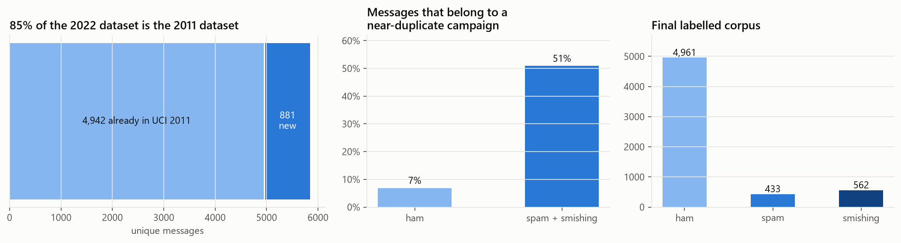
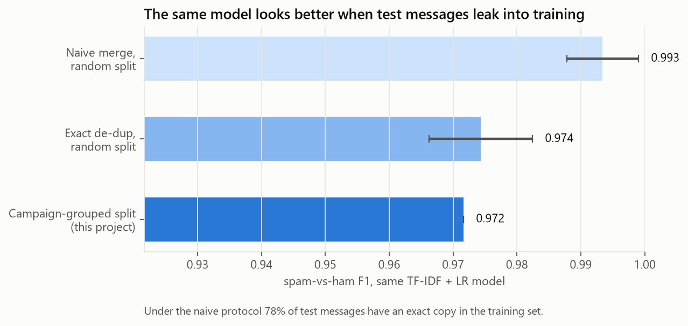
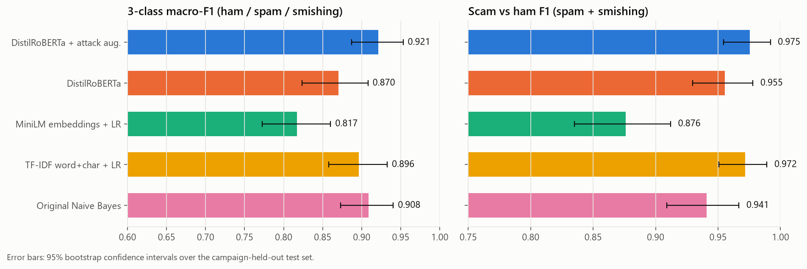
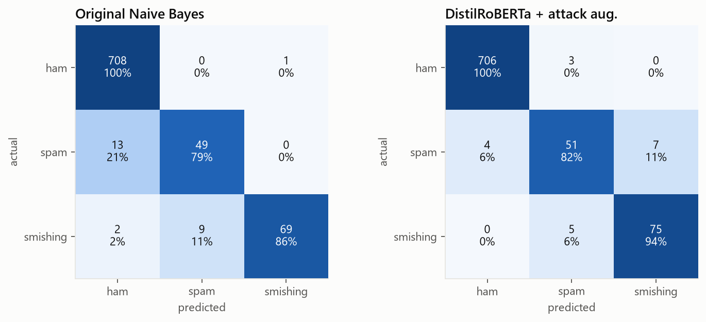
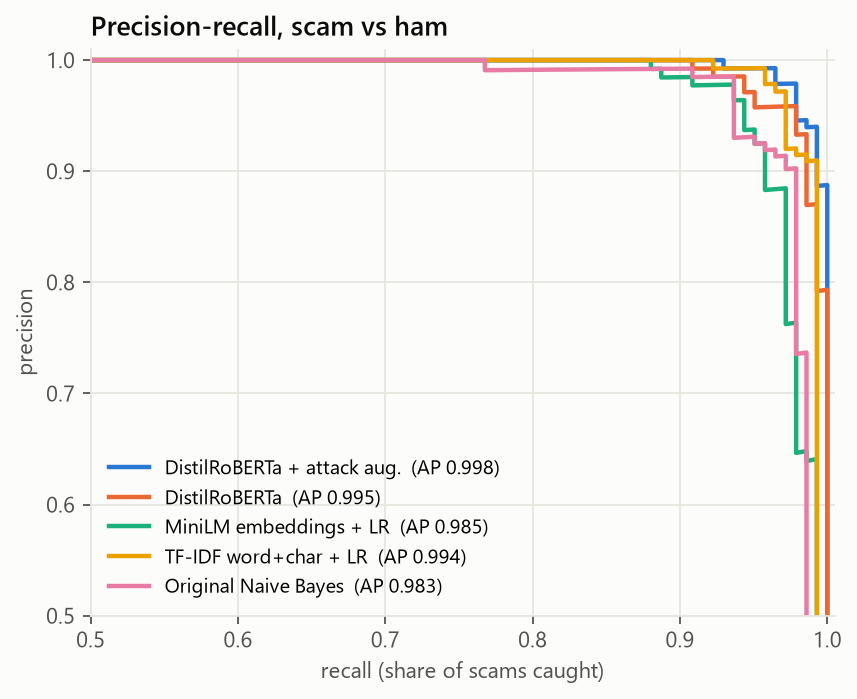
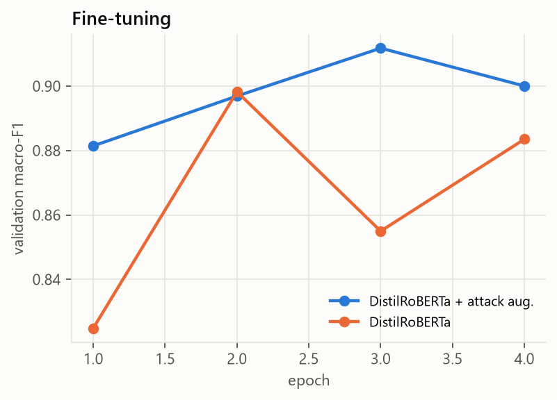
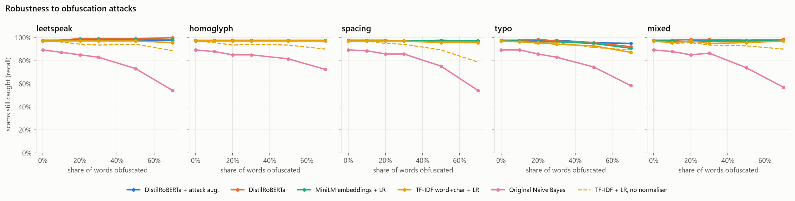
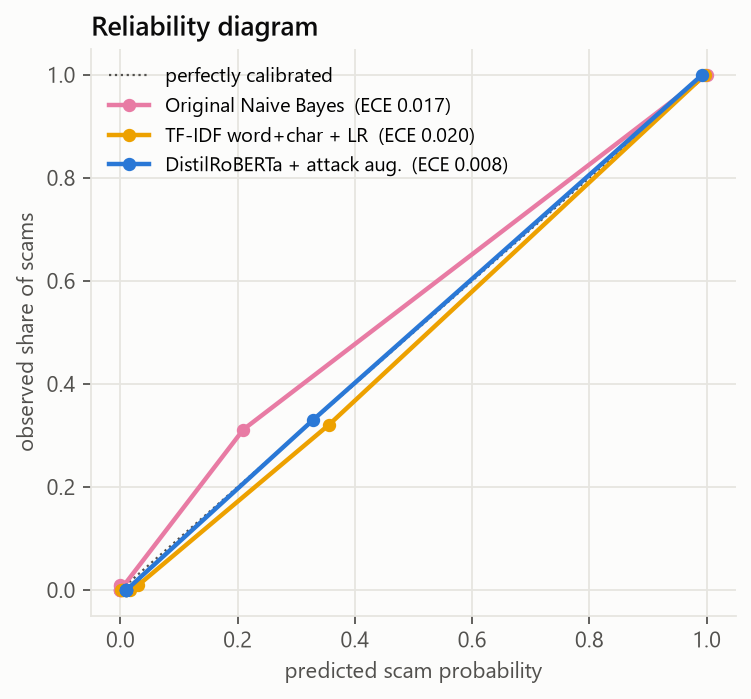
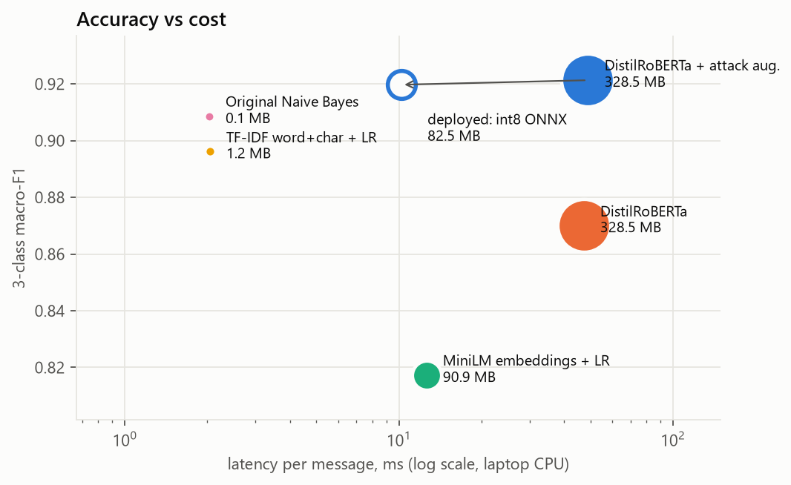

# Detecting SMS scams honestly: leakage, campaigns and obfuscation

Hamad Ur Rehman · October 2026 · [code](https://github.com/hamad470/spam-detector) ·
[live demo](https://huggingface.co/spaces/hamadurrehman62/spam-detector) ·
[model](https://huggingface.co/hamadurrehman62/sms-scam-distilroberta)

## Summary

I rebuilt a 2024 Naive Bayes SMS spam notebook into a three-class scam detector (ham, marketing spam,
smishing). Most of the work turned out to be in the data and the evaluation, not the model:

- The 2022 smishing dataset I added is 85% copies of the 2011 dataset, and half of all spam comes from
  templated campaigns. A naive merge with a random split leaks exact copies of 78% of test messages into training.
- With campaigns held out of training, the fine-tuned DistilRoBERTa reaches **0.920 macro-F1**, catches
  **97.9% of scams**, flags **0.42% of real texts** and recalls **93.8% of smishing**. It's an
  82.5 MB int8 ONNX model that runs in the browser.
- Training on obfuscated copies of messages helped more on clean data than I expected (macro-F1 0.870 to 0.921),
  and a rule-based normaliser does most of the work against disguised text.
- The model doesn't generalise to email, and it misses scams that have no link, prize or number.

## 1. Data

| Source | Messages | Labels |
|---|---:|---|
| UCI SMS Spam Collection, 2011 | 5,572 | ham, spam |
| Mishra & Soni SMS Phishing Dataset, 2022 | 5,971 | ham, spam, smishing |
| Enron-Spam (test split only) | 2,000 | ham, spam (email) |

**Overlap.** After repairing mojibake with `ftfy` and matching on letters and digits only, 4,942 of the 5,823
unique Mendeley messages are UCI messages. The broken encoding (`£` for `£`) is why a plain string match
misses this. Only 881 Mendeley messages are new.

**A damaged mirror.** The UCI copy most people download from Kaggle escapes quotes as `\"` and cuts 44 messages
off at the first quote. I only noticed because a reproducibility check against the official UCI zip didn't match.
Everything here uses the official file.

**Campaigns.** I clustered messages with MinHash LSH (5-character shingles, digits masked to 0, Jaccard ≥ 0.7).
51% of spam and smishing sit in a cluster with at least one other message, against 7% of ham. These are the same
prize draw or ringtone offer sent with a different short code.

**Label noise.** 35 Mendeley messages appear twice with different labels, and 23 campaign clusters contain
copies labelled spam and copies labelled smishing. That puts a ceiling on how cleanly any model can separate
the two scam classes.

**Final corpus.** 6,006 unique messages: 4,961 ham, 433 spam, 562 smishing, plus 50 UCI spam messages with no
subtype. Those 50 are excluded from three-class training and only used to check that they're flagged as scams.
The split is made per cluster with `StratifiedGroupKFold` (roughly 70/15/15), so no campaign appears in two splits.

## 2. How much does leakage matter?

Same model (TF-IDF + logistic regression), same binary task, three protocols:

| Protocol | Scam F1 |
|---|---:|
| Concatenate both datasets, random split (3 seeds) | 0.993 ± 0.006 |
| Exact de-duplication first, random split (3 seeds) | 0.974 ± 0.008 |
| Exact + near-duplicate grouping, split by campaign | 0.972 |

Almost all of the inflation comes from exact copies: under the naive protocol 78% of test messages are already
in the training set. Near-duplicate grouping costs a further 0.002, which is inside the noise for this model.
I kept it anyway: it's the protocol that matches deployment, where next week's campaign is new, and the
difference may be larger for models that memorise more.

## 3. Models

All five use the same split and are scored on the same 851 test messages.

| Model | What it is |
|---|---|
| Naive Bayes | My original notebook: stemming, TF-IDF (3,000 terms), chi-squared top 1,000, Bernoulli NB |
| TF-IDF + LR | Word 1-2-grams and character 2-5-grams, normalised text, class-balanced logistic regression |
| MiniLM + LR | Frozen `all-MiniLM-L6-v2` sentence embeddings, logistic regression |
| DistilRoBERTa | `distilroberta-base` fine-tuned, 4 epochs, square-root class weights, early stopping on validation macro-F1 |
| DistilRoBERTa + aug. | As above, plus an obfuscated copy of every scam message and of 20% of ham |

Every model except Naive Bayes sees text through the same `prepare()` step: undo leetspeak, Cyrillic
look-alikes, spaced-out letters and zero-width characters, then replace links, phone numbers and amounts with
tags. Naive Bayes keeps its original preprocessing so it stays a faithful baseline.

The decision rule is the same for all models: flag as a scam if P(spam) + P(smishing) ≥ 0.5, then pick the more
likely scam type. Plain argmax over three classes can call a message ham while 59% of its probability says scam.

## 4. Results

| Model | Macro-F1 (95% CI) | Scam F1 | Precision | Recall | Real texts flagged | Smishing recall | PR-AUC |
|---|---|---:|---:|---:|---:|---:|---:|
| **DistilRoBERTa + aug.** | **0.921** (0.887–0.953) | **0.975** | 0.979 | 0.972 | 0.42% | **93.8%** | **0.998** |
| Naive Bayes | 0.908 (0.873–0.940) | 0.941 | **0.992** | 0.894 | **0.14%** | 86.3% | 0.983 |
| TF-IDF + LR | 0.896 (0.858–0.933) | 0.972 | 0.972 | 0.972 | 0.56% | 88.7% | 0.994 |
| DistilRoBERTa | 0.870 (0.824–0.908) | 0.955 | 0.933 | **0.979** | 1.41% | 80.0% | 0.995 |
| MiniLM + LR | 0.817 (0.773–0.860) | 0.876 | 0.798 | 0.972 | 4.94% | 82.5% | 0.985 |

Confidence intervals are 1,000-sample bootstraps over test messages.

What I take from this:

- **Naive Bayes is a strong baseline on clean text.** It has the fewest false alarms of any model. Its weakness
  is recall: it misses one scam in ten.
- **Frozen sentence embeddings were the worst option.** MiniLM embeddings blur exactly the surface cues (short
  codes, "txt", "£") that separate scams from chat, and flag one real text in twenty.
- **Augmentation helped on clean data, not just attacked data.** Without it, the fine-tuned model overfits
  (validation macro-F1 peaks at epoch 2 and then swings); with it, training is steadier. The augmented model is
  better on macro-F1, precision, false alarms, smishing recall and calibration. The plain model catches
  marginally more scams overall (97.9% vs 97.2%) but at three times the false-alarm rate. Obfuscated copies seem
  to act as a regulariser here. With one run per setting I wouldn't put a number on the size of that effect.
- **On the 121 test messages that only exist in the 2022 dataset** the augmented model scores 0.952 macro-F1,
  the highest of the five, so it isn't just doing well on UCI-era text.

## 5. Robustness to obfuscation

Four character-level attacks, applied to a growing share of words in every test scam: leetspeak (`fr33`),
Cyrillic look-alikes (`frее`), spacing (`f.r.e.e`) and adjacent-letter typos (`fere`), plus a mix of all four.
The y-axis is the share of scams still caught.

- **Naive Bayes** has no normaliser and collapses: 89% of scams caught on clean text, 54% with 70% of words in
  leetspeak or spacing.
- **The normaliser does most of the work.** TF-IDF + LR with the normaliser keeps 96-97% under every attack
  except heavy typos. The same model without it (dashed line) drops to 79% under heavy spacing.
- **Typos are where the transformer earns its place.** The normaliser can't undo a swapped letter. At 70% typos
  the augmented transformer still catches 95% of scams, against 87% for TF-IDF + LR.
- **Attacks don't create false alarms.** With 30% of words obfuscated in real texts, the augmented model flags
  0.85% of them, against 6.5% for MiniLM + LR.

## 6. Calibration

Fine-tuned transformers are usually overconfident, and this one was: temperature scaling on the validation set
learned T = 1.87. After scaling, expected calibration error on the test set is 0.008, the lowest of the five
models. The probabilities the demo shows can be read roughly at face value.

## 7. Out of domain: email

| Model | Enron ROC-AUC | Enron F1 |
|---|---:|---:|
| Naive Bayes | 0.546 | 0.548 |
| TF-IDF + LR | 0.572 | 0.573 |
| MiniLM + LR | 0.612 | 0.590 |
| DistilRoBERTa | 0.556 | 0.587 |
| DistilRoBERTa + aug. | 0.614 | 0.587 |

Every model is close to chance on email. SMS spam is short, full of short codes and text-speak, and its ham is
casual chat. Email spam and email ham both look nothing like that. An SMS filter is an SMS filter.

## 8. Cost and deployment

I exported the augmented model to ONNX and applied dynamic int8 quantisation:

| | PyTorch fp32 | ONNX int8 |
|---|---:|---:|
| Size | 328.5 MB | 82.5 MB |
| Latency, one message, laptop CPU | 49 ms | 10 ms |
| Test macro-F1 | 0.921 | 0.920 |
| Scam F1 | 0.975 | 0.979 |
| Decisions that differ | | 4 of 851 (0.5%) |

**Running it in the browser.** Hugging Face now charges for server-backed Spaces, so the live demo has no
server: a static page downloads the int8 model once (cached afterwards) and runs it with ONNX Runtime Web. That
meant porting the normaliser, the decision rule and the occlusion explanations to JavaScript, and I didn't want
to trust a port by eye. `python -m spam_detector.web_fixtures` writes the Python outputs for 254 messages
(test messages, attacked variants and edge cases such as full-width text, emoji, zero-width characters and a
message longer than the 96-token limit), and a Node test suite checks the JavaScript against them:

| Check | Result |
|---|---|
| Normalised text | identical on all 254 |
| Token IDs, including truncation | identical on all 254 |
| Final label | identical on all 254 |
| Probabilities | median difference 0.0003, max 0.10 |
| Strong explanation words (impact ≥ 0.5) | same words |

The probabilities aren't bit-identical because WebAssembly and native ONNX Runtime round int8 matrix products
differently. In the browser a check takes 0.4 to 1.2 s on a laptop, explanation included, and messages never
leave the device. A FastAPI + Docker version of the same model stays in the repo for anyone who needs an API.

If cost mattered more than smishing recall, TF-IDF + LR is the honest alternative: 70× smaller and 5× faster for
about 2.5 points of macro-F1.

## 9. Error analysis (deployed model, test set)

|  | predicted ham | predicted spam | predicted smishing |
|---|---:|---:|---:|
| **ham** | 706 | 3 | 0 |
| **spam** | 3 | 51 | 8 |
| **smishing** | 0 | 5 | 75 |

**Missed scams (3).** All three lack the usual hooks. One is a "how come a child afraid of the dark becomes a
teenager…" chain message with the call to action cut off, one is a ringtone order receipt, and one reads like a
personal note ("Hi this is Amy…").

**False alarms (3).** A shouty all-caps text from a friend ("JUSWOKE UP IN A BED ON A BOATIN THE DOCKS…"), a
"Today is ACCEPT DAY" chain message, and a message that is nothing but a university URL. The last one shows the
model has learned "bare link = suspicious", which is usually right.

**Spam vs smishing (13).** Most of these are label noise rather than model error. "For ur chance to win £250 cash
every wk TXT: ACTION to 80608" is labelled spam in the test set, and near-identical prize texts are labelled
smishing elsewhere in the same dataset. The model calls it smishing, which I'd argue is the safer reading.

**Messages I wrote myself.** Current UK scams with a link or a prize are caught: a parcel fee (98.5%), an HMRC
refund (98.8%), a crypto withdrawal (95.8%). Genuine one-time codes, an Uber arrival and a dentist reminder all
pass at about 2%. Two misses matter: "Hi mum, I've dropped my phone, this is my new number, can you send £200"
scores 1.5%, and a fake Netflix billing alert scores 48%, just under the threshold.

## 10. Limitations and what I'd do next

1. **Newer data.** The biggest gap is social-engineering scams with no link or prize ("Hi mum", fake bank
   callbacks). I'd collect recent public examples (Action Fraud and Ofcom publish them) and label a few hundred.
2. **Seeds.** Each configuration was trained once. Three to five seeds would put error bars on the augmentation
   effect.
3. **Threshold per use.** A personal inbox filter should sit at very low false alarms; a "warn me" banner can
   afford more. The PR curve supports either; the demo uses 0.5.
4. **Labels.** Re-labelling the 23 conflicting campaigns would probably add more to spam-vs-smishing accuracy than
   any model change.
5. **URL features.** The strongest single signal is the link. Domain age or reputation lookups would help, but
   they need a live service, which is out of scope for a free demo.

## Reproducing

Every number and figure above comes from `reports/results.json`, which `python -m spam_detector.evaluate`
regenerates. The full command sequence is in the [README](../README.md#reproduce-it). Fine-tuning takes about an
hour per model on a laptop CPU (Intel i5-1235U).
